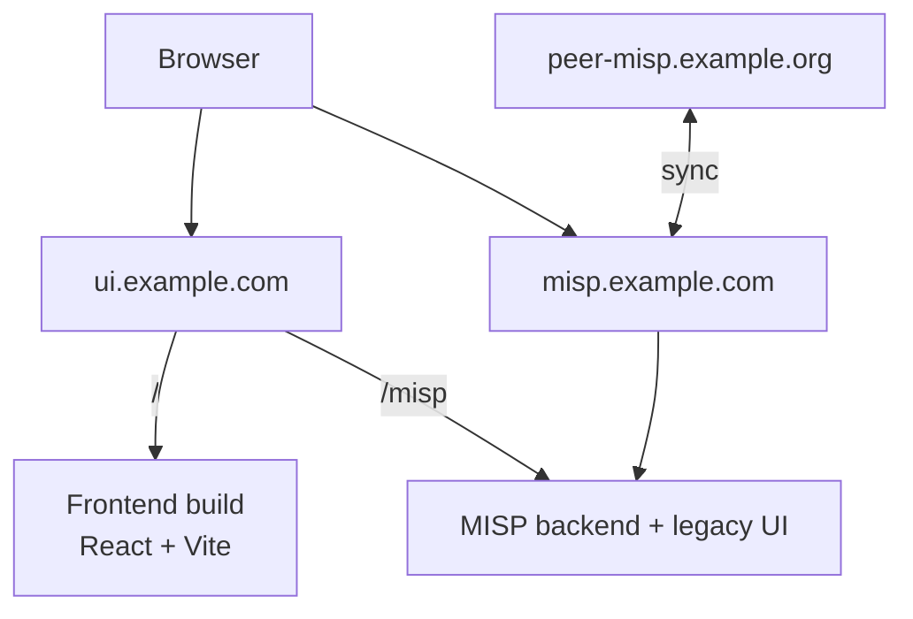

# MISP Nexus

Rebuilding the MISP UI with React + Vite.

## Architecture

- Local development:
  - frontend: `http://localhost/`
  - MISP + legacy UI: `http://localhost/misp/`
  - direct MISP debug ports: `http://localhost:8081/` and `https://localhost:8443/`
- Deployment:
  - frontend: `https://ui.example.com/`
  - canonical MISP URL: `https://misp.example.com/`
- Frontend requests should use relative `/misp/...` URLs
- Authentication uses the standard MISP session cookie
- MISP should keep its canonical `BASE_URL` on the MISP host, not on `/misp`



## Setup

- Clone with submodules:

```bash
git clone git@github.com:NontasBak/misp-nexus.git
git submodule update --init
```

- Create the MISP Docker env file:

```bash
cp misp-docker.env.example misp-docker/.env
```

## Run

```bash
cd frontend
pnpm install
pnpm build # or `pnpm dev` for development

cd ..
docker compose up -d
```
